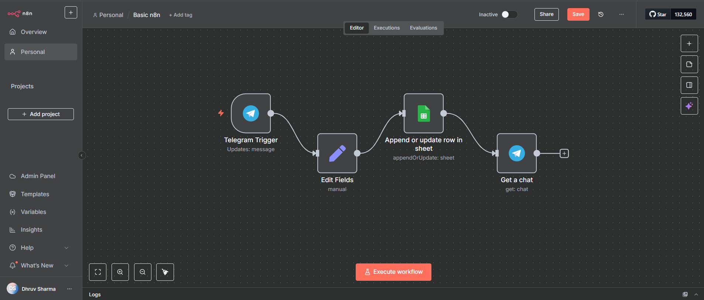
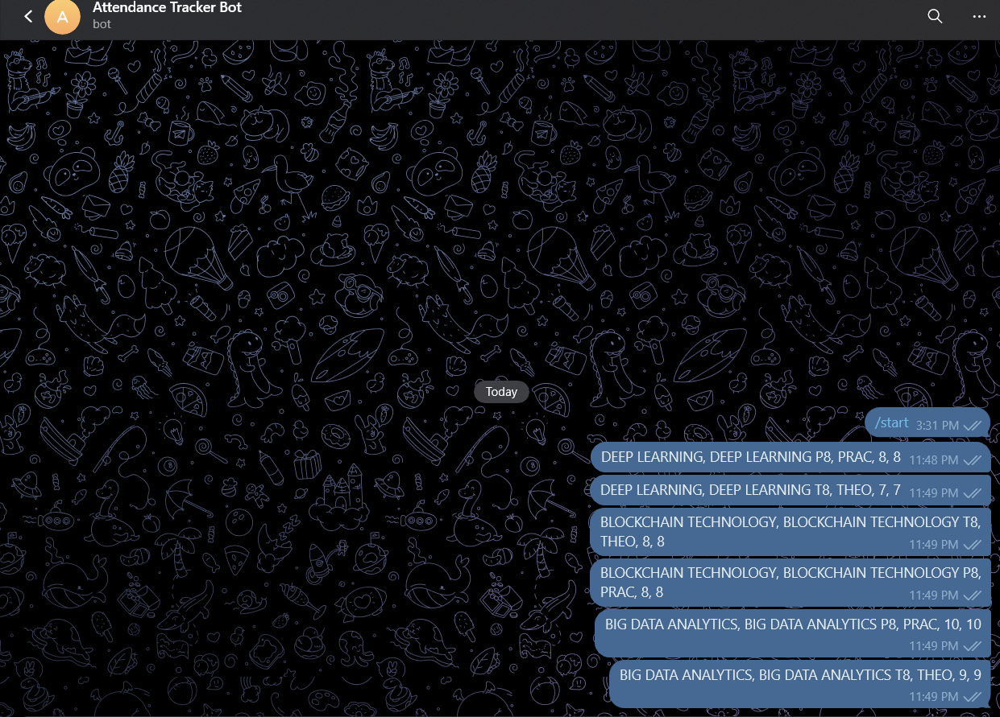
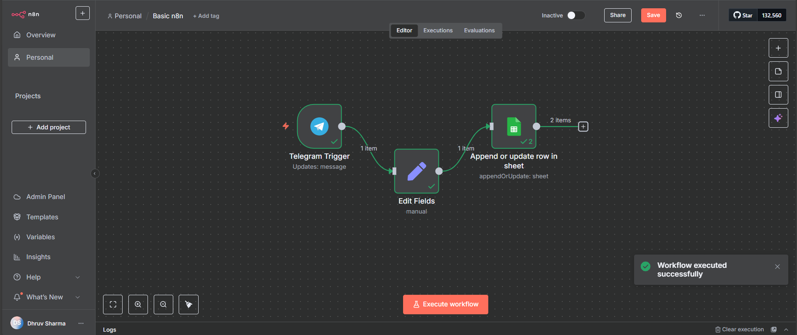
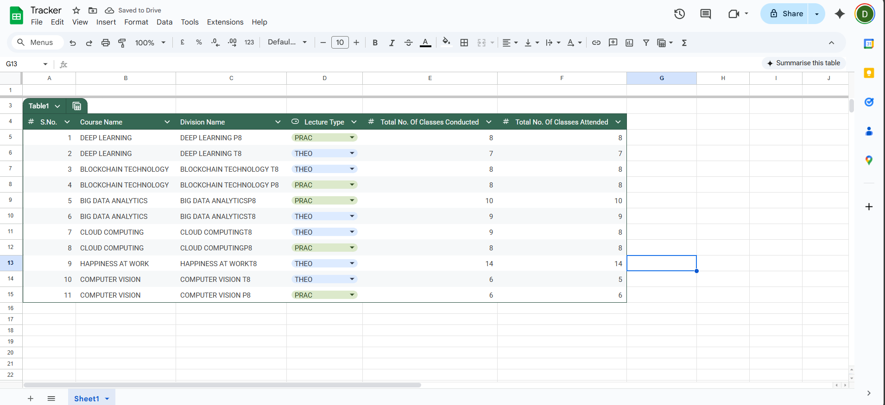

# Telegram & n8n Attendance Tracker

A no-code automation that logs class attendance from Telegram messages directly to Google Sheets using n8n.

## How It Works

1. Send attendance data via Telegram bot
2. n8n workflow processes and validates the message
3. Data gets logged to Google Sheets automatically
4. Bot sends confirmation message






## Usage

Send message to your Telegram bot in this format:
```
Course Name, Division Name, Lecture Type, Classes Conducted, Classes Attended
```

**Example:**
```
DEEP LEARNING, DEEP LEARNING T8, THEO, 7, 7
```

## Quick Setup

1. **Create Telegram Bot** via @BotFather and get the token
2. **Setup Google Sheet** with columns: Course Name, Division Name, Lecture Type, Classes Conducted, Classes Attended
3. **Import workflow.json** to n8n and add your credentials
4. **Test** by sending a message to your bot

## Sample Data Format

| Course Name | Division Name | Lecture Type | Classes Conducted | Classes Attended |
|-------------|---------------|--------------|-------------------|------------------|
| DEEP LEARNING | DEEP LEARNING T8 | THEO | 7 | 7 |
| BLOCKCHAIN TECHNOLOGY | BLOCKCHAIN TECHNOLOGY P8 | PRAC | 8 | 8 |
| BIG DATA ANALYTICS | BIG DATA ANALYTICSP8 | PRAC | 10 | 10 |

## Requirements

- n8n instance (cloud or self-hosted)
- Google Sheet with proper column headers
- Telegram Bot token from BotFather

That's it! Your attendance tracker is ready to use.